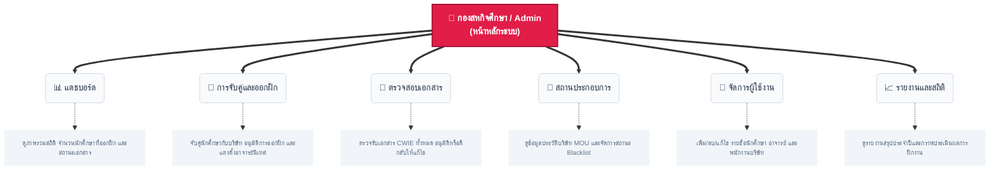
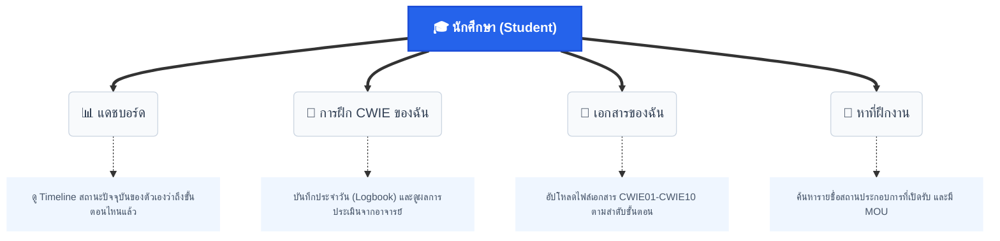

# โครงสร้างเมนูและฟีเจอร์ของระบบ (System Flow & Features)

เอกสารนี้แสดงภาพรวมการทำงานของระบบในบทบาท (Role) ที่มีเมนูและหมวดหมู่การใช้งานมากที่สุด เพื่อให้เห็นภาพรวมของเว็บไซต์ได้ชัดเจนที่สุดเมื่อนำไปพรีเซนต์

## 1. บทบาท: กองสหกิจศึกษา (Office) และ ผู้ดูแลระบบ (Admin)
บทบาทนี้เป็นศูนย์กลางในการควบคุมระบบทั้งหมด มีเมนูให้ใช้งานเยอะที่สุดเพื่อจัดการข้อมูลของทุกๆ ฝ่าย

---

## 2. บทบาท: นักศึกษา (Student)
หน้าจอของนักศึกษาจะเน้นไปที่การทำตาม Flow การออกฝึกงาน ตั้งแต่เริ่มจนจบ

> [!TIP]
> **เทคนิคการพรีเซนต์:** คุณสามารถเปิดไฟล์นี้ใน Visual Studio Code (หรือ GitHub) เพื่อให้โปรแกรมสร้างกราฟ (Diagram) สวยๆ ออกมาให้กรรมการดูได้ทันที ซึ่งแสดงให้เห็นถึงการออกแบบ User Experience (UX) ที่เป็นระบบและเข้าใจง่าย
